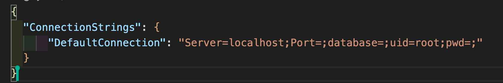

<h1 align="center"><strong>

# _Dr. Sneuss' Factory_ 
</strong></h1>

<h1 align="center">

#### _Welcome to Dr. Sneuss' Factory Engineer & Machine Tracker using C# & many to many relationships, 2020 ver 1.0_

#### By _Ian Gregg_
[Dr-Sneuss-Factory](https://github.com/oldgregg89/Dr.-Sneuss-Factory-Solution)

## Description

_Welcome to Dr. Sneuss' Factory Engineer & Machine Tracker using C# & many to many relationships_

## Setup/Installation Requirements

* to clone this content, copy the url provided by the `clone or download` button in GitHub
* in command line use the command 'git clone (GitHub url)'
* open the program in a code editor
* you will need [.NET] (https://dotnet.microsoft.com/download/dotnet-core/2.2) installed to run this program 
* then install dotnet script REPL by typing `dotnet tool installl -g dotnet-script` in the command line
* type dotnet build in the command line to compile the code
* create a `.gitignore` file and store the bin and obj folders in .gitignore
* type `dotnet watch run` in the command line to run the program
* run `dotnet add package Microsoft.EntityFrameworkCore -v 2.2.0`  &
`dotnet add package Pomelo.EntityFrameworkCore.MySql -v 2.2.0`
in the terminal
* add a file called `appsetting.json` in the Factory directory.
* in `appsetting.json` add 
* fill in your `server`, `port`,`database`,`uid`, and `pwd`
* Make suere to have your `MySQLWorkbench` open
* run 
`dotnet ef migrations add Initial`
then `dotnet ef database update`
* if everything looks correct you should see this as the home page: 

__

## Specs

| Behavior    | Input | Output |
| :---------- | ----- | -----: |
| Machine list | `click` Machine List | `displays` Machine List |
| Edit Machine | `click` Edit Machine | `displays` Edit machine details|
| Delete Machine | `click` Delete Machine | `displays` delete menu |

## Known Bugs

_No known bugs_

## Support and contact details

_Contact Ian Gregg: <iangregg188@gmail.com>_

## Technologies Used

_The Technologies used in the making of this software was Chrome browser, Visual Studio editor, and Mac, C#, .Net, MySQLWorkbench_

### License

Copyright (c) 2020 **_Ian Gregg_**

Permission is hereby granted, free of charge, to any person obtaining a copy of this software and associated documentation files (the “Software”), to deal in the Software without restriction, including without limitation the rights to use, copy, modify, merge, publish, distribute, sublicense, and/or sell copies of the Software, and to permit persons to whom the Software is furnished to do so, subject to the following conditions:
The above copyright notice and this permission notice shall be included in all copies or substantial portions of the Software.
THE SOFTWARE IS PROVIDED “AS IS”, WITHOUT WARRANTY OF ANY KIND, EXPRESS OR IMPLIED, INCLUDING BUT NOT LIMITED TO THE WARRANTIES OF MERCHANTABILITY, FITNESS FOR A PARTICULAR PURPOSE AND NONINFRINGEMENT. IN NO EVENT SHALL THE AUTHORS OR COPYRIGHT HOLDERS BE LIABLE FOR ANY CLAIM, DAMAGES OR OTHER LIABILITY, WHETHER IN AN ACTION OF CONTRACT, TORT OR OTHERWISE, ARISING FROM, OUT OF OR IN CONNECTION WITH THE SOFTWARE OR THE USE OR OTHER DEALINGS IN THE SOFTWARE.

## Remember you can always reach out to the editor if this doesn't make sense.

</h1>